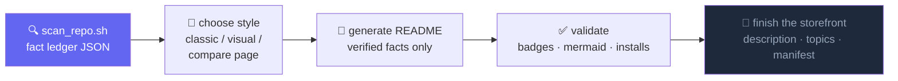
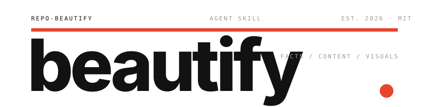
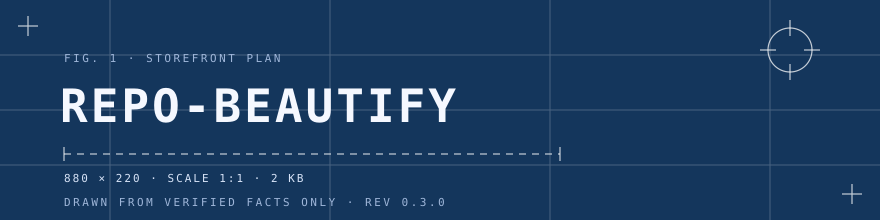
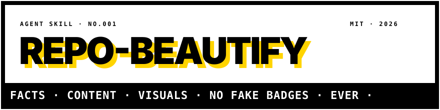
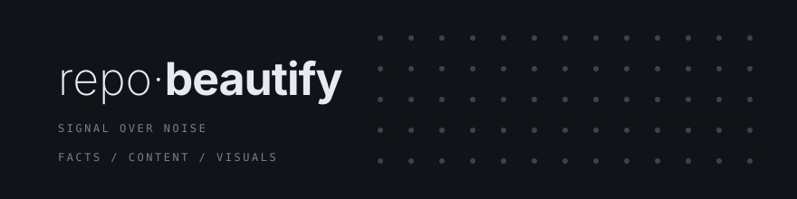
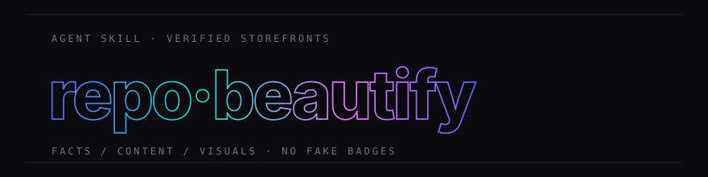
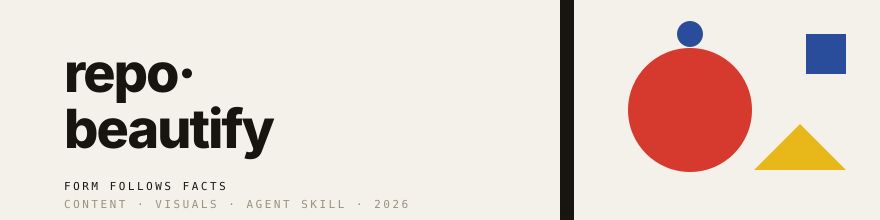

<div align="center">


<br/>


[](LICENSE)

</div>

---

## 🧭 The Problem

Asking an AI agent to "make my README beautiful" usually produces a pretty page of lies:

```text
npm install -g your-package        # ...that was never published to npm
[]()   # ...with no CI configured
"⭐ Loved by thousands of developers"                             # ...at 0 stars
```

And the README is only half the storefront. The GitHub description, topics, social preview, and package manifest stay empty while everyone stares at the banner.

## ✨ The Fix

**repo-beautify** is an [Agent Skill](https://agents.md) that beautifies in three layers, in order: facts, content, visuals. Every claim in the output must cite a "fact ledger" entry: the scan JSON, an existing file path, a command output, or a live API result.



## 🚀 Quick Start

Install with the [skills](https://skills.sh) CLI:

```bash
npx skills add LaughingisLaughing/repo-beautify
```

Then ask your agent, in any words:

> Beautify this repo's storefront with the repo-beautify skill. Scan the facts first, show me two README styles to choose from, and fix the GitHub description and topics too.

## 📦 What's Inside

| File | Role |
| --- | --- |
| `SKILL.md` | The workflow and the hard rules (fact ledger, no fabrication, docs must survive re-skinning) |
| `scripts/scan_repo.sh` | Storefront fact scanner: manifest gaps, license, registry publish status, GitHub description/topics, community files, demo assets |
| `scripts/build_compare.py` | Renders README variants side-by-side with GitHub CSS (mermaid + dark mode) so you pick a style in the browser |
| `assets/template-classic.md` | Best-README-Template lineage, contributor-oriented |
| `assets/template-visual.md` | Hero banner, typing animation, badges, social card, mermaid, star history |
| `assets/heroes/` | Ten self-hosted animated hero SVG templates (previews below) |
| `references/visual-services.md` | URL recipes and pitfalls for capsule-render, typing-svg, shields, socialify, star-history |
| `references/readme-structure.md` | Section order, per-project-type adaptation, content-merge rules |

## 🎨 Hero Style Catalog

Ten self-hosted hero styles ship with this skill. Each is a ~2KB animated SVG: zero JS, zero third-party requests, readable from frame 0. Pick one by name when you run the skill ("use the bauhaus hero"). Templates live in [`assets/heroes/`](assets/heroes/), the banners below are the live previews.

**swiss** · paper grid, extreme weight contrast, an accent square hopping between stations


**aurora** · Linear-style dark gradient, three blurred blobs drifting on async clocks


**vignelli** · oversized cropped wordmark, sweeping red rule, breathing period


**orbit** · terminal prompt with blinking cursor, satellites orbiting a source of truth


**blueprint** · engineering drawing: construction grid, marching measurement line, rotating compass


**brutalist** · thick frame, hard-shadow type, an endless ticker strip


**dotwave** · LED dot matrix with a diagonal pulse wave


**editorial** · literary masthead: serif title, small caps, rotating ornament


**outline** · stroke-only wordmark with a flowing color gradient


**bauhaus** · geometric primaries, an orbiting moon and a swaying triangle


## 💬 Prompts You Can Paste

<details>
<summary><b>Full storefront makeover</b></summary>

```text
Use the repo-beautify skill on this repository. Run the fact scan, generate both README styles, build the comparison page, and after I pick one, apply it and fix the repo description, topics, and manifest fields.
```

</details>

<details>
<summary><b>Compare styles only</b></summary>

```text
Use repo-beautify to generate classic and visual README variants for this repo and open the comparison page. Do not change any files yet.
```

</details>

<details>
<summary><b>Metadata only</b></summary>

```text
Use repo-beautify step 5 only: audit this repo's GitHub description, topics, manifest fields, releases, and community files, and fix what is missing. Leave the README alone.
```

</details>

## 🛡️ Hard Rules

1. **Fact ledger**: every claim cites the scan JSON, a file path, a command output, or an API result.
2. **Never fabricate**: no badge or install command for anything that does not exist. `unknown` registry state means ask, not guess.
3. **Re-skinning never loses docs**: old sections are inventoried and mapped, collapsed maybe, deleted never.
4. **Scale to the project**: a 50-line script does not get a 300-line README.

## 📝 Notes

- The visual style depends on third-party image services (capsule-render, shields, socialify, star-history). They are storefront flair; never encode load-bearing information only in a generated image.
- Headless screenshots freeze SVG animations at frame 0; verify banners via `curl | grep '<text'`, not screenshots.
- GitHub caches README images through camo; expect propagation delay after URL changes.

## ⭐ Star History

<div align="center">
<a href="https://star-history.com/#LaughingisLaughing/repo-beautify&Date">
  
</a>
</div>

---

<div align="center">

**MIT** © [LaughingisLaughing](https://github.com/LaughingisLaughing)

</div>
