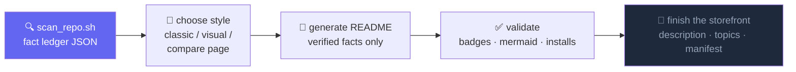

<div align="center">


<br/>


[](LICENSE)

</div>

<p align="center"><a href="README.md">English</a> | 简体中文</p>

---

## 🧭 问题

叫 AI agent「把 README 弄漂亮」，拿到手的多半是一页漂亮的谎言：

```text
npm install -g your-package        # ……这个包从未发布到 npm
[]()   # ……仓库根本没配 CI
"⭐ Loved by thousands of developers"                             # ……实际 0 star
```

何况 README 只是门面的一半：GitHub 简介、topics、社交预览图、包清单字段全空着，大家却只顾着看横幅。

## ✨ 解法

**repo-beautify** 是一个 [Agent Skill](https://agents.md)，美化分三层、顺序固定：先核事实，再写内容，最后上视觉。产出里的每一句话，都要在「事实台账」里有出处：扫描 JSON、真实存在的文件路径、命令输出，或者线上 API 的返回结果。



## 🚀 快速开始

用 [skills](https://skills.sh) CLI 安装：

```bash
npx skills add LaughingisLaughing/repo-beautify
```

装好后，怎么顺口怎么说：

> 用 repo-beautify 给这个仓库做门面。先扫一遍事实，出两种 README 风格让我挑，GitHub 简介和 topics 也一起修好。

## 📦 内容清单

| 文件 | 作用 |
| --- | --- |
| `SKILL.md` | 工作流和硬规则（事实台账、禁止造假、改版不丢文档） |
| `scripts/scan_repo.sh` | 门面事实扫描器：manifest 缺什么字段、license、registry 发布状态、GitHub 简介和 topics、社区文件、demo 素材 |
| `scripts/build_compare.py` | 用 GitHub 样式并排渲染多个 README 方案（带 mermaid 和暗色模式），在浏览器里挑风格 |
| `scripts/check_bilingual.py` | 中英双语 README 的对齐校验器：命令块、链接、图片、标题数必须一一对应 |
| `scripts/publish_audit.py` | 发布安全审计：密钥、危险文件、本地路径、私人邮箱，覆盖工作区和完整 git 历史 |
| `assets/template-classic.md` | Best-README-Template 一脉的经典结构，面向贡献者 |
| `assets/template-visual.md` | 横幅、打字动效、徽章、社交卡片、mermaid、star 趋势 |
| `assets/heroes/` | 10 款自托管动画 hero SVG 模板（预览见下方画廊） |
| `references/visual-services.md` | capsule-render、typing-svg、shields、socialify、star-history 的 URL 配方和踩坑记录 |
| `references/readme-structure.md` | 章节顺序、按项目类型适配、内容合并规则 |
| `references/bilingual-readme.md` | 中文版 README 的翻译边界、语气规范和校验流程 |
| `references/publish-safety.md` | 审计结果处置指南：先轮换再清史、历史改写、哪些不用修 |

## 🎨 Hero 风格目录

本 skill 自带 10 款自托管 hero 风格，每款都是约 2KB 的动画 SVG：零 JS、零第三方请求、首帧即可读。用的时候报名字就行，比如「hero 用 bauhaus 那款」。模板在 [`assets/heroes/`](assets/heroes/)，下面的横幅就是实时预览。

**swiss** · 纸感网格，字重对比强烈，accent 方块在站点之间跳动


**aurora** · Linear 一脉的暗色渐变，三团光晕各自漂移


**vignelli** · 超大裁切字，红杠扫过，句点一呼一吸


**orbit** · 终端提示符加闪烁光标，卫星绕着唯一事实源转


**blueprint** · 工程制图：施工网格、行进中的标注线、缓缓旋转的罗盘


**brutalist** · 粗边框、硬阴影大字、跑不完的跑马灯


**dotwave** · LED 点阵，脉冲波沿对角线扫过


**editorial** · 文学刊头：衬线标题、small caps、慢转的花饰


**outline** · 纯描边字，渐变色顺着笔画流动


**bauhaus** · 几何三原色，小球公转，三角摇摆


## 💬 可直接粘贴的提示词

<details>
<summary><b>门面全套改造</b></summary>

```text
对这个仓库使用 repo-beautify skill。先跑事实扫描，生成两种 README 风格并构建对比页；我选定之后应用它，并把仓库简介、topics 和 manifest 字段一并修好。
```

</details>

<details>
<summary><b>只对比风格</b></summary>

```text
用 repo-beautify 为这个仓库生成 classic 和 visual 两版 README，打开对比页。先不要改动任何文件。
```

</details>

<details>
<summary><b>只修元数据</b></summary>

```text
只执行 repo-beautify 的第 5 步：审计这个仓库的 GitHub 简介、topics、manifest 字段、releases 和社区文件，缺什么补什么。README 保持不动。
```

</details>

<details>
<summary><b>开源前安全审计</b></summary>

```text
对这个仓库执行 repo-beautify 的发布安全审计，包含 git 历史。逐条分诊审计结果，告诉我哪些是阻断项，并带我在公开仓库之前把它们修完。
```

</details>

## 🛡️ 硬规则

1. **事实台账**：每句话都要有出处，出处只认四样：扫描 JSON、文件路径、命令输出、API 结果。
2. **禁止造假**：不存在的东西，不配徽章，也不写安装命令。registry 状态是 `unknown` 就去问，不许猜。
3. **改版不丢文档**：旧章节先盘点、再映射，可以折叠，不许删。
4. **体量匹配项目**：50 行的脚本，配不上 300 行的 README。

## 📝 注意事项

- visual 风格依赖几个第三方图片服务（capsule-render、shields、socialify、star-history），它们只是门面点缀，关键信息绝不能只存在于生成的图片里。
- 无头截图会把 SVG 动画定格在第 0 帧。验证横幅要用 `curl | grep '<text'`，别信截图。
- GitHub 用 camo 代理缓存 README 图片，改了图片 URL 之后，线上要过一阵子才会刷新。

## ⭐ Star 趋势

<div align="center">
<a href="https://star-history.com/#LaughingisLaughing/repo-beautify&Date">
  
</a>
</div>

---

<div align="center">

**MIT** © [LaughingisLaughing](https://github.com/LaughingisLaughing)

</div>
