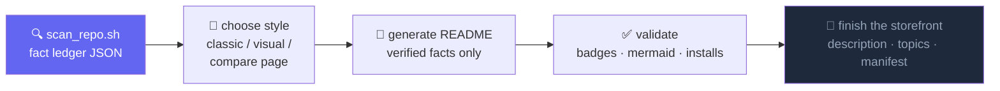

<div align="center">


<br/>


[](LICENSE)

</div>

<p align="center"><a href="README.md">English</a> | 简体中文</p>

---

## 🧭 问题

让 AI agent "把我的 README 弄漂亮",得到的通常是一页漂亮的谎言:

```text
npm install -g your-package        # ……这个包从未发布到 npm
[]()   # ……仓库根本没配 CI
"⭐ Loved by thousands of developers"                             # ……实际 0 star
```

而且 README 只是门面的一半:GitHub 简介、topics、社交预览图、包清单字段全都空着,所有人却只盯着横幅看。

## ✨ 解法

**repo-beautify** 是一个 [Agent Skill](https://agents.md),按固定顺序分三层做美化:先事实,再内容,最后视觉。产出中的每一条论断都必须能在"事实台账"里找到出处:扫描 JSON、真实存在的文件路径、命令输出、或线上 API 结果。



## 🚀 快速开始

用 [skills](https://skills.sh) CLI 安装:

```bash
npx skills add LaughingisLaughing/repo-beautify
```

然后用任何说法吩咐你的 agent:

> 用 repo-beautify skill 美化这个仓库的门面。先扫描事实,给我两种 README 风格挑选,GitHub 的简介和 topics 也一并修好。

## 📦 内容清单

| 文件 | 作用 |
| --- | --- |
| `SKILL.md` | 工作流与硬规则(事实台账、禁止造假、改版不丢文档) |
| `scripts/scan_repo.sh` | 门面事实扫描器:manifest 缺失字段、license、registry 发布状态、GitHub 简介/topics、社区文件、demo 素材 |
| `scripts/build_compare.py` | 用 GitHub CSS 并排渲染多个 README 方案(支持 mermaid 和暗色模式),在浏览器里选风格 |
| `scripts/check_bilingual.py` | 中英双语 README 的 parity 校验器:命令块、链接、图片、标题数必须一一对应 |
| `assets/template-classic.md` | Best-README-Template 谱系,面向贡献者的经典结构 |
| `assets/template-visual.md` | 横幅、打字动效、徽章、社交卡片、mermaid、star 趋势 |
| `assets/heroes/` | 10 个自托管动画 hero SVG 模板(预览见下方画廊) |
| `references/visual-services.md` | capsule-render、typing-svg、shields、socialify、star-history 的 URL 配方与坑 |
| `references/readme-structure.md` | 章节顺序、按项目类型适配、内容合并规则 |
| `references/bilingual-readme.md` | 中文版 README 的生成边界、语气规范与校验流程 |

## 🎨 Hero 风格目录

本 skill 自带 10 种自托管 hero 风格。每个都是约 2KB 的动画 SVG:零 JS、零第三方请求、首帧即可读。运行 skill 时报名字即可("用 bauhaus 那款 hero")。模板在 [`assets/heroes/`](assets/heroes/),下面的横幅就是实时预览。

**swiss** · 纸感网格,极端字重对比,accent 方块在站点间跳动


**aurora** · Linear 一系的暗色渐变,三团光晕异步漂移


**vignelli** · 超大裁切字,红色横杠扫过,句点呼吸


**orbit** · 终端提示符与闪烁光标,卫星环绕唯一事实源


**blueprint** · 工程制图:施工网格、行进的标注线、旋转的罗盘


**brutalist** · 粗框、硬阴影大字、无尽跑马灯


**dotwave** · LED 点阵,对角线脉冲波


**editorial** · 文学刊头:衬线标题、small caps、旋转花饰


**outline** · 纯描边字,渐变色沿笔画流动


**bauhaus** · 几何三原色,公转的小球与摇摆的三角


## 💬 可直接粘贴的提示词

<details>
<summary><b>门面全套改造</b></summary>

```text
对这个仓库使用 repo-beautify skill。先跑事实扫描,生成两种 README 风格并构建对比页;我选定后应用它,并修好仓库简介、topics 和 manifest 字段。
```

</details>

<details>
<summary><b>只对比风格</b></summary>

```text
用 repo-beautify 为这个仓库生成 classic 和 visual 两版 README 并打开对比页。先不要改动任何文件。
```

</details>

<details>
<summary><b>只修元数据</b></summary>

```text
只执行 repo-beautify 的第 5 步:审计这个仓库的 GitHub 简介、topics、manifest 字段、releases 和社区文件,把缺的补上。README 保持不动。
```

</details>

## 🛡️ 硬规则

1. **事实台账**:每条论断都要能指向扫描 JSON、文件路径、命令输出或 API 结果之一。
2. **禁止造假**:不存在的东西不配徽章、不写安装命令。registry 状态是 `unknown` 就去问,不许猜。
3. **改版不丢文档**:旧章节先盘点再映射,可以折叠,不许删除。
4. **体量匹配项目**:50 行的脚本不配 300 行的 README。

## 📝 注意事项

- visual 风格依赖第三方图片服务(capsule-render、shields、socialify、star-history)。它们只是门面点缀;承载关键信息的内容绝不能只放在生成图片里。
- 无头截图会把 SVG 动画定格在第 0 帧;验证横幅请用 `curl | grep '<text'`,不要靠截图。
- GitHub 通过 camo 代理缓存 README 图片;改了图片 URL 后预期有传播延迟。

## ⭐ Star 趋势

<div align="center">
<a href="https://star-history.com/#LaughingisLaughing/repo-beautify&Date">
  
</a>
</div>

---

<div align="center">

**MIT** © [LaughingisLaughing](https://github.com/LaughingisLaughing)

</div>
